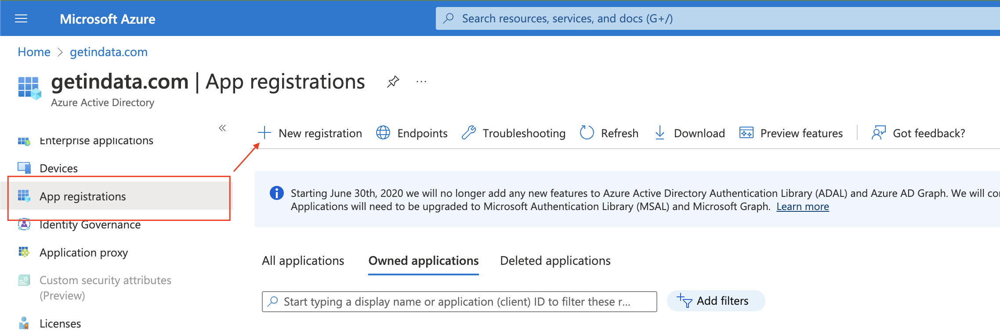
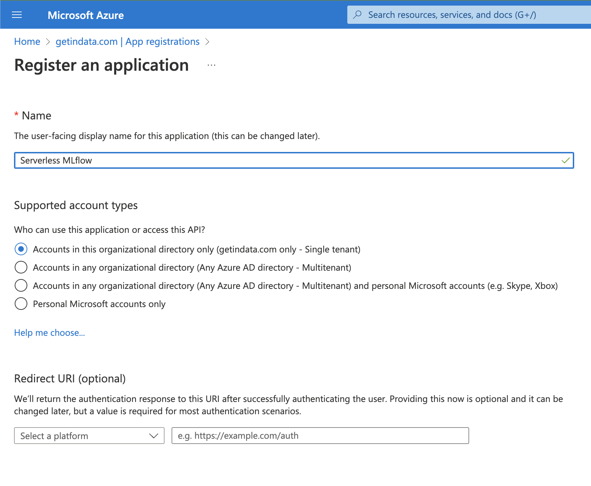
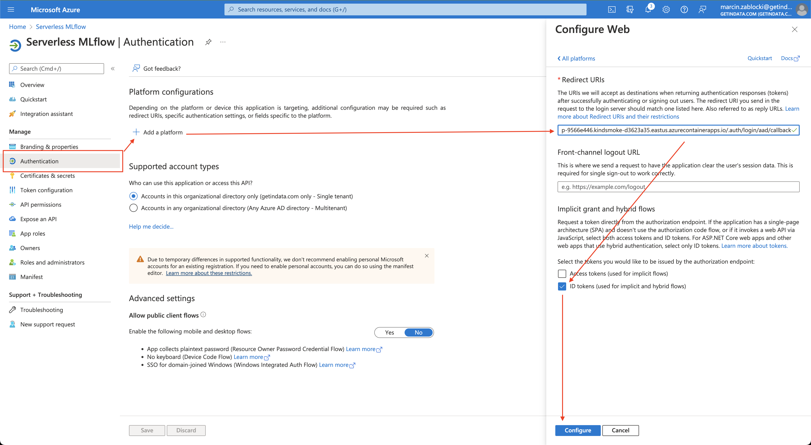

## Authentication
Useful docs:
* https://docs.microsoft.com/en-us/azure/container-apps/authentication
* AD: https://docs.microsoft.com/en-us/azure/container-apps/authentication-azure-active-directory
* Google: https://docs.microsoft.com/en-us/azure/container-apps/authentication-google

As of 2022-08-11 the module only supports AD and Google providers.

## Google
As far as I've tested, when using Google provider, `Authorization: Bearer <token>` header is not supported, so using this with MLflow will require implementing additional `mlflow.request_header_provider`.

1. Obtain Client ID and Client Secret from GCP OAuth Credentials.
2. Set the `auth` variable in the module:
```terraform
  auth = {
    type = "google"
    client_secret = "<client secret>"
    client_id = "<client id>"
  }
```
3. Run terraform apply
4. Take the `mlflow_tracking_uri` output from the module and set appropriate callback in Google OAuth 2.0 config: `<mlflow_tracking_uri>/.auth/login/google/callback`
5. Save the settings.

### User login
Users will login with standard redirect to Google page.

### Server to server
Needs to use: https://docs.microsoft.com/en-us/azure/container-apps/authentication#client-directed-sign-in
1. Obtain the token
```bash
export T=$(curl -X POST -L https://<mlflow url on .azurecontainerapps.io>/.auth/login/google -d "{\"id_token\": \"$(gcloud auth print-identity-token)\"}" -H "Content-Type: application/json" | jq -r .authenticationToken )
```
2. Use the token
```bash
curl -L https://<mlflow url on .azurecontainerapps.io>/api/2.0/mlflow/experiments/list -H "X-Zumo-Auth: $T"
```

## Azure Active Directory
1. Create App Registration in Azure Active Directory

2. Fill the name (for now, Redirect URL will be empty).

3. In the newly created app, open `Certificates & secrets` section.
4. In `Client secrets` tab, click `New client secret` and create one. Save `Value` (this value will be only displayed once!).
5. Set the `auth` variable in the module:
```terraform
auth = {
  type = "azureActiveDirectory"
  client_secret = "<client secret>"
  client_id = "<Application (client) ID>"
  azureActiveDirectory = {
    tenant_id = "<Directory (tenant) ID>"
  }
}
```
6. Run terraform apply
7. Take the `mlflow_tracking_uri` output from the module
8. Open `Authentication` section, in _Platform configurations_ click `Add platform`, select `Web`, fill in `Redirect URIs` with `<mlflow_tracking_uri>/.auth/login/aad/callback`, select `ID tokens (used for implicit and hybrid flows)` and click _Configure_.


### User login
Users will login with standard redirect to Microsoft login page.

### Server to server
1. Prepare:
* client id
* client secret
* tenant id
2. Obtain the token from Microsoft endpoint
```bash
export T=$(curl -X POST -H 'Content-Type: application/x-www-form-urlencoded' \
https://login.microsoftonline.com/<tenant id>/oauth2/v2.0/token \
-d 'client_id=<client id>' \
-d 'grant_type=client_credentials' \
-d 'scope=<client id>%2f.default' \
-d 'client_secret=<client secret>' | jq -r .access_token) 
```
Note that `scope` has both `<client id>` and a suffix `%2f.default` which is a url encoded `./default`.
3. Use the token
```bash
curl -L https://<mlflow url on .azurecontainerapps.io>/api/2.0/mlflow/experiments/list -H "Authorization: Bearer $T"
```
